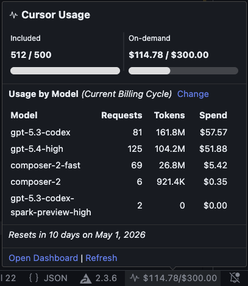

# Cursor Usage

See Cursor usage in your status bar: included requests and on-demand spend, live while you work.

## What you get

- Compact status bar display (for example: `500/500 | $114.78/$300`).
- Detailed hover tooltip with progress bars, reset countdown, and per-model usage.
- Loading indicator while fresh usage data is being fetched.
- Quick action to open a usage summary and dashboard link.
- Smart refresh behavior tied to editor activity and window focus.
- Optional minimal mode to show only the active metric.

## Commands

- `Cursor Usage: Show Details` - open usage summary with dashboard link.
- `Cursor Usage: Refresh` - force a refresh immediately.

## Settings

- `cursorUsage.pollInterval` (default: `5`) - minimum refresh cooldown in minutes (`1`, `5`, `10`, `30`, `60`).
- `cursorUsage.minimalMode` (default: `false`) - show only the active metric.
- `cursorUsage.usageDuration` (default: `billingCycle`) - model-usage range: `1d`, `7d`, `30d`, or `billingCycle`.

## Privacy and behavior

- No manual API key setup required.
- Uses your existing signed-in Cursor session locally.
- Fetches on activity (editing/focus) instead of constant polling.
- Caches auth and API responses to avoid redundant requests.

## License

MIT
